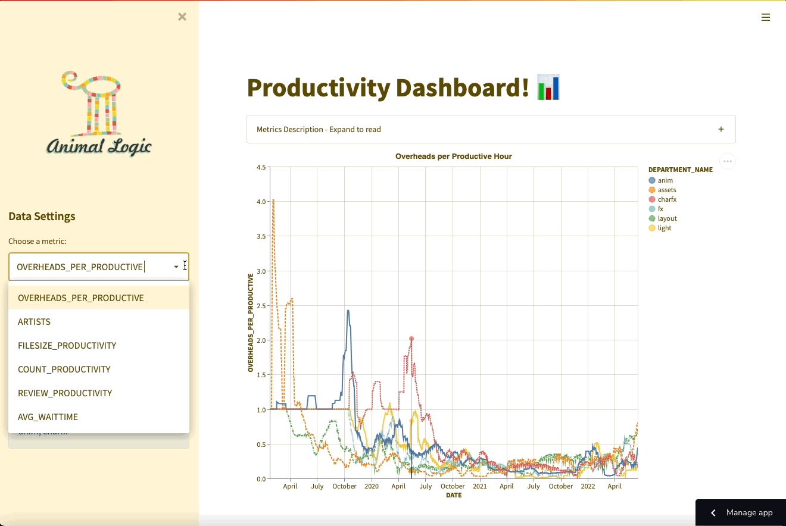
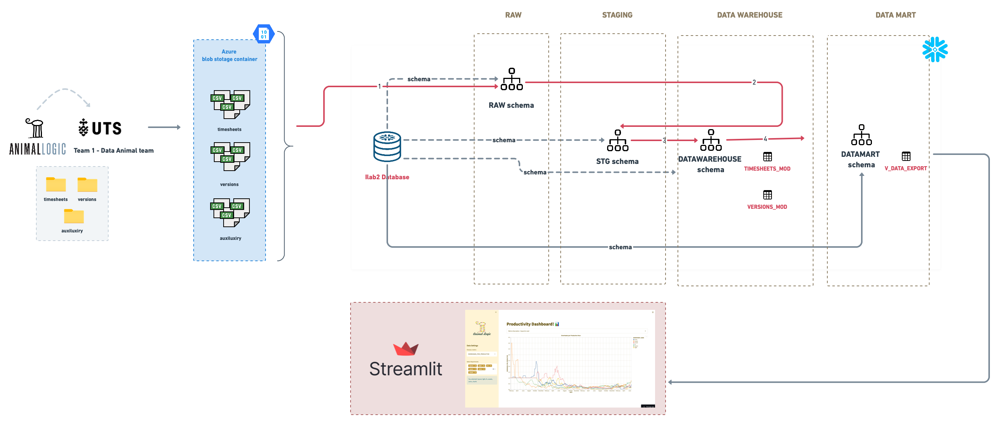

[](https://ndleah-al-data-pipeline-home-vzc1tq.streamlitapp.com)

# Productivity Analysis Dashboard 

> Group project for the iLab2 subject - Spring 2022

## 🎥 Demo


## 👤 Client Description

Our client, Animal Logic is an animation company with multiple awards in the animation and film industry. It has been recognised as one of the world's leading creative animation and visual effect digital studios, producing award-winning design, visual effects and animation for over 30 years.

 <br>

**Problem Statement:**
> With at least hundreds of thousands of frames in every finished animation film product, which requires hundreds of people working together for years, the coordination and efficient flow of information and data are critical to the client's business success.
</br>

## 🎯 Goal 
* Evaluating and developing new productivity metrics for a partner in a niche industry. 
* Proposing a pipeline to simplify and possibly automate the analysis and presentation of the analysis to these stakeholders was therefore a secondary goal. 

## 📝 Metrics Description

To achieve a holistic view of the productivity, our group created several metrics that approximate a variety of different concepts we think are important to understanding the data in its context: 
* **Overhead Hours:** The Total Hours with the task description: td, prod, supervision, meeting, training, di, or NULL. This should represent the number of hours spent not producing direct value. 
* **Productive Hours:** Total Hours – Overhead Hours. This should represent the hours that directly produce value. 
* **Overheads Per Productive Hour:** Overhead Hours / Productive Hours. This should represent the number of hours spent on tasks with indirect value for every immediately productive hour. 
* **Artists:** The total artists assigned tasks on this project during the date range displayed. This should approximate the overall workload assigned to a department. 
* **Count Productivity:** The total number of submissions for review within a date range / Total Hours. This should approximate the total task load of a department. 
* **File size Productivity:** The total file size of all assets submitted for review / Total Hours. This should approximate workload including complexity. 
* **Review Productivity:** The weighted value of assets submitted for review / Total Hours. Director review = 1, Internal review = 0.75, Surplus review = 0.01. This should approximate the direct importance of the work completed. 
* **Average Wait Time:** The average time a shot has waited since it was last submission by another department. First submissions and consecutive submissions by the same department are ignored and the average wait time of all versions submitted on that day is taken. 

## Application Framework




## Folder Structure

```bash
./AL-data-pipeline
├── .github/
│   └── pull_request_template.md             <- pull request template for team  collaboration
│
├── .streamlit/
│   ├── config.toml                          <- Streamlit application theme configuration file
│
├── archieve/                                <- folder which stores the old working files of our team
│   ├── AL-data-pipeline.Rproj
│   ├── EDA.ipynb            (Michelle)      
│   ├── Overheads.R          (Wililam)
│   ├── combine_data_leah.R  (Leah)          
│   ├── eda_leah.R           (Leah)
│   └── snowflake code - upload.txt (William)
│
├── img/                                     <- folder which stores illustration for this GH project
│   ├── Animal_Logic_logo.png
|   ├── demo.gif
│   └── framework.png
│
├── utils/                                   <- application modules folder
│   ├── chart.py                             <- define functions for building application charts modules folder
│   └── db.py                                <- establish connection between Snowflake and Streamlit for data extraction
│
├── .gitignore
├── README.md
├── home.py                                  <- the main python script to run the Streamlit application
└── requirements.txt                         <- package dependencies used for this application
```

## ⚙️ Instructions

The app can be accessed directly via [](https://ndleah-al-data-pipeline-home-vzc1tq.streamlitapp.com)

> However, if you wish to deploy the app on your local machine, simply follow these steps:

Clone the repository

```bash
git clone https://github.com/ndleah/AL-data-pipeline.git
cd AL-data-pipeline
```

Run the Docker container with docker compose

```bash
pip install -r requirements.txt 
streamlit run home.py
```

The application will start in detached mode and can now be accessed via [http://localhost:8501](http://localhost:8501). 


